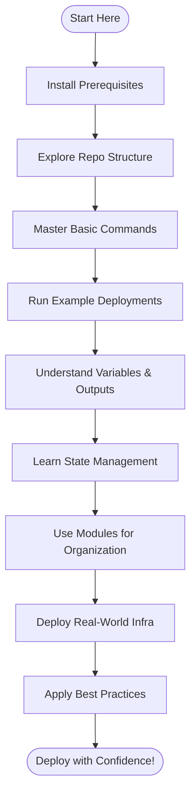

# 🚀 Terraform Complete Guide for Beginners to Advanced

A comprehensive, step-by-step repository to master [Terraform](https://www.terraform.io/) through real-world, practical examples. This guide is ideal for both beginners and advanced users aiming to build, manage, and version cloud infrastructure efficiently.

---

## 📘 What is Terraform?

Terraform is an **Infrastructure as Code (IaC)** tool developed by **HashiCorp**. It enables you to define and provision infrastructure using simple, human-readable configuration files. With Terraform, you can automate the setup, change, and versioning of your cloud environments.

---

## 🔥 Why Use Terraform?

Terraform offers several advantages that make it the preferred choice for modern DevOps and Cloud Engineering teams:

- ✅ **Automate Cloud Infrastructure**: Reduce human error and automate the creation, modification, and destruction of resources.
- ✅ **Version Controlled & Repeatable Deployments**: Store your infrastructure code in Git for traceable, repeatable deployments.
- ✅ **Works Across AWS, Azure, GCP**: Use one tool to manage resources across multiple cloud providers.
- ✅ **Declarative & Scalable**: Focus on *what* you want to deploy, not *how*—Terraform figures out the rest.

---

## 🛠️ Prerequisites

Before you start, make sure your environment meets these requirements:

| Requirement   | Description                   |
|---------------|------------------------------|
| Cloud Account | AWS / Azure / GCP            |
| AWS CLI       | For Cloud Authentication     |
| Terraform CLI | Main IaC Tool                |
| IAM User      | Programmatic Access          |

---

## 📥 Installation Guide

### 🔹 Install Terraform on Ubuntu

```bash
sudo apt update && sudo apt install -y gnupg software-properties-common curl
curl -fsSL https://apt.releases.hashicorp.com/gpg | sudo apt-key add -
sudo apt-add-repository "deb [arch=amd64] https://apt.releases.hashicorp.com $(lsb_release -cs) main"
sudo apt update
sudo apt install terraform
terraform -version
```

### 🔹 Install AWS CLI

```bash
sudo apt install awscli -y
aws --version
```

### 🔹 Configure AWS

```bash
aws configure
```

**Enter the following when prompted:**

- AWS Access Key
- AWS Secret Access Key
- Default Region (e.g., `ap-south-1`)
- Output Format (`json`)

---

## 📂 Repository Structure

The repository is organized to facilitate progressive learning and hands-on practice:

```text
terraform/
├── Day-1       # Basics & Provider Setup
├── Day-2       # Multiple Terraform demos
├── Day-3       # Variables, Outputs, tfvars
├── Day-4       # Modules & Advanced Config
├── Day-5       # Real-world deployment (S3 + static hosting)
└── README.md
```

✨ *Each folder contains practical `.tf` files to help you learn step-by-step.*

---

## ⚙️ Terraform Basic Commands

Here are the most used Terraform CLI commands:

```bash
terraform init      # Initialize working directory
terraform plan      # Preview changes before applying
terraform apply     # Create/modify infrastructure
terraform destroy   # Delete all resources
```

---

## 📁 Example: AWS EC2 Resource

A minimal Terraform example to provision an AWS EC2 instance:

```hcl
provider "aws" {
  region = "ap-south-1"
}

resource "aws_instance" "my_ec2" {
  ami           = "ami-0abcdef1234567890"
  instance_type = "t2.micro"
}
```

---

## 🎯 Variables & Outputs Example

### variables.tf

```hcl
variable "instance_type" {
  type    = string
  default = "t2.micro"
}
```

### outputs.tf

```hcl
output "public_ip" {
  value = aws_instance.my_ec2.public_ip
}
```

### terraform.tfvars

```hcl
instance_type = "t2.small"
```

---

## 🗃️ Terraform State Management

Terraform manages your cloud resources using state files:

- **terraform.tfstate** → Tracks the real infrastructure.
- **terraform.tfstate.backup** → Auto-backup of the previous state.

> 🚫 **Never commit state files!**  
> Always add them to your `.gitignore`.

---

## 🧠 Best Practices

- ✔ **Use variables** for reusability.
- ✔ **Organize code using modules** to keep things maintainable.
- ✔ **Always review with `terraform plan`** before applying changes.
- ✔ **Use a remote backend (S3 + DynamoDB)** for production state files.
- ✔ **Use Git** for version control and collaboration.

---

## 📚 Topics Covered

| Day   | Topics                   | Key Concepts                    |
|-------|--------------------------|---------------------------------|
| Day-1 | Basics                   | Provider, Resource, Init        |
| Day-2 | Multiple Examples        | EC2, S3, State Files            |
| Day-3 | Variables & Outputs      | Reusability, tfvars             |
| Day-4 | Modules                  | Modular Infrastructure          |
| Day-5 | Deployment               | S3 Static Website Hosting       |

---

## 🏁 Conclusion

By following this repository, you will:

- ✅ **Build Infrastructure** using Terraform
- ✅ **Manage State & Variables** professionally
- ✅ **Deploy Cloud Resources** end-to-end
- ✅ **Follow Best Practices** for production environments

---

## 📞 Need Support?

Feel free to raise an issue or reach out!

**Happy Terraforming!** 🚀

---

## 🗺️ Learning Workflow Overview

Below is a flowchart that visualizes your typical learning path as you follow this guide:



---

## 🔑 Common Use Cases

- **Provisioning EC2, S3, and other AWS resources** for dev or prod environments.
- **Learning modular infrastructure** by splitting Terraform into reusable modules.
- **Automating infrastructure** for repeatable, versioned cloud deployments.
- **Practicing IaC best practices** for real-world scenarios.

---

## 📝 Contribution

We welcome contributions! Please create a pull request or open an issue if you want to add new demos or clarify concepts.

---

**Now you’re ready to become a Terraform Pro!** 🚀
